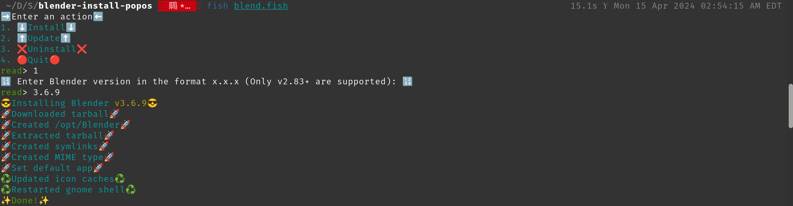
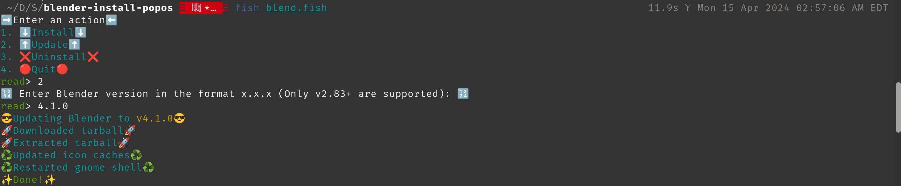
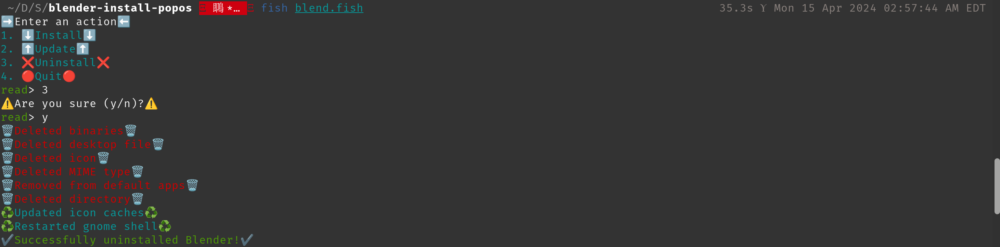

# README

This repo enables installing/updating/uninstalling Blender v2.83+ in PopOS. It uses fish shell for all of those actions. It was created as the latest versions of Blender take a long time to appear in the official repo. Doesn't work with Blender versions < 2.83.x due to versioning differences.

## Dependencies
1. fish shell 🐬

## ⬇️ Install Blender ⬇️
Install performs the following steps:
1. Download specified version tarball to ~/Downloads
2. Extract tarball to /opt/Blender
3. Delete tarball
4. Create symlinks for blender and blender-thumbnailer binaries
5. Create MIME type
6. Set as the default app for .blend files 
7. Update icon caches with Blender icons

To install, open a fish shell inside the repo, execute ```fish blend.fish```, and enter 1


Example: Installing Blender v3.6.9

## ⬆️ Update Blender ⬆️
Update performs the following steps:
1. Download specified version tarball to ~/Downloads
2. Clean /opt/Blender
3. Extract tarball to /opt/Blender
4. Delete tarball
5. Update icon caches with Blender icons

To update, open a fish shell inside the repo, execute ```fish blend.fish```, and enter 2


Example: Updating to Blender v4.1.0

## ❌ Uninstall Blender ❌
Uninstall performs the following steps:
1. Delete Blender directory (/opt/Blender)
2. Delete binaries
3. Delete desktop file
4. Delete icon
5. Delete MIME type
6. Remove from default apps

To uninstall, open a fish shell inside the repo, execute ```fish blend.fish```, and enter 3


Example: Uninstalling Blender

👏👏👏 Thanks to **spitzak** on [devtalk.blender.org](https://devtalk.blender.org/t/how-to-install-in-linux-including-desktop-icons/33513/6) for giving detailed steps.
