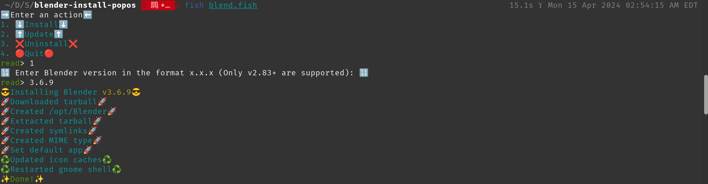
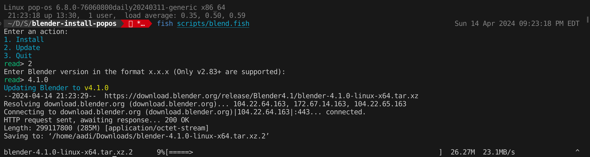

# README

This repo allows installing/updating Blender v2.83+ in PopOS. It uses the fish shell for both of those actions. It was created as the latest versions of Blender take a long time to appear in the official repo. Doesn't work with Blender versions < 2.83.x due to versioning differences.

## Install actions
1. Download specified version tarball to ~/Downloads
2. Extract tarball to /opt/Blender
3. Delete tarball
4. Create symlinks for blender and blender-thumbnailer binaries
5. Update icon caches with Blender icons
6. Restart Gnome shell to make Blender appear in the launcher (Works with X11. If you're using Wayland, you'll need to re-login)

## Update actions
1. Download specified version tarball to ~/Downloads
2. Extract tarball to /opt/Blender
3. Delete tarball
4. Update icon caches with Blender icons
5. Restart Gnome shell to make Blender appear in the launcher (Works with X11. If you're using Wayland, you'll need to re-login)

## Dependencies
1. fish shell 🐬

## Installing Blender
Open a fish shell inside the repo, execute ```fish scripts/blend.fish```, and enter 1



Example: Install Blender v4.0.0

## Updating Blender
Open a fish shell inside the repo, execute ```fish scripts/blend.fish```, and enter 2



Example: Updating to Blender v4.1.0

👏👏👏 Thanks to spitzak on [devtalk.blender.org](https://devtalk.blender.org/t/how-to-install-in-linux-including-desktop-icons/33513/6) for giving detailed steps.
